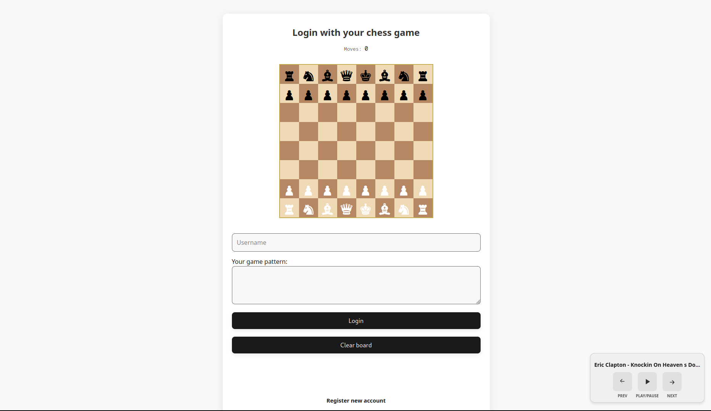

# ChessNotes

ChessAuth-notes a web app for personal note-taking, featuring a unique, never seen before chess game-based authentication system and a built-in music player (why not).

---

## Screenshot



---

## What is ChessNotes?

ChessNotes lets you log in and register using chess game notation as your password.
Instead of typing a password, you play a sequence of chess moves, and the server hashes and securely stores this game notation as your password.

It may seem like a password with extra steps, but it is secure because it’s hashed and security is importan yk.

Once inside, you can:
- Keep your diary and take notes.
- Tag and search notes.
- Manage your account.
- Listen to your (or my) favorite music.

---

<details>
<summary><h2>Features</h2></summary>

- **Chess-based Authentication**
  - Register and log in by playing a chess game instead of typing a password.
  - Your chess pattern is hashed with `bcrypt` 'cause it must be secure.

- **Personal Diary & Notes**
  - Add, edit, and delete notes.
  - Tag notes (important, work, idea, etc.) and filter them easily.

- **Account Management**
  - Change your username or your notation password at any time.
  - Delete your account (with a decuple-confirmation modal for safety).

- **Integrated Music Player**
  - Listen to music while you are trying to make your password.
  - Play, pause, and skip songs in your playlist.

</details>

---

<details>
<summary><h2>Tech Stack</h2></summary>

**Frontend**
- HTML5, CSS3, Vanilla JavaScript (ES Modules)

**Backend**
- Node.js + Express.js
- SQLite3 (local database)
- `bcrypt` (secure password hashing)
- `express-rate-limit` (rate limiting for login)
- `helmet` (security headers)
- `express-session` (session management)

</details>

---

<details>
<summary><h2>Project Structure</h2></summary>

```

chess-auth/
├── public/ \# Frontend files
│ ├── style.css
│ ├── confirm-modal.css
│ ├── home.html
│ ├── login.html
│ ├── register.html
│ ├── account.html
│ ├── chess-board.js
│ ├── chess-handler.js
│ ├── music-player.js
│ ├── home.js
│ ├── login.js
│ ├── register.js
│ ├── account.js
│ ├── utils.js
│ ├── footer.js
│ ├── music/ # Your music files (.mp3, .wav, etc.)
│ └── favicon.ico
├── chessnotes.db # SQLite database (created automatically)
├── server.js # Express.js backend
├── package.json
├── package-lock.json
├── .gitignore
└── .env.example

```

</details>

---

## API Endpoints

- **Auth**
  - `POST /api/register` – `{ username, password }`
  - `POST /api/login` – `{ username, password }`
  - `POST /api/logout`
  - `GET /api/session`

- **Account**
  - `PUT /api/account` – `{ newUsername, newPassword }`
  - `DELETE /api/account`

- **Notes**
  - `GET /api/notes`
  - `POST /api/notes` – `{ content, tag }`
  - `PUT /api/notes/:id` – `{ content, tag }`
  - `DELETE /api/notes/:id`

- **Music**
  - `GET /api/music` – returns array of music file URLs

---

<details>
<summary><h2>Security</h2></summary>

- Chess patterns are hashed with bcrypt before storing.
- The login endpoint is protected by rate limiting to prevent brute-force attacks.
- The application uses security headers to protect against common web vulnerabilities.
- Sessions are managed securely (set `cookie.secure: true` for HTTPS in production).
- All note/account actions require authentication.

</details>

---

<details>
<summary><h2>Customization</h2></summary>

- **Chess Logic:**
  Powered by [chess.js](https://github.com/jhlywa/chess.js).

- **Music:**
  Add/remove files in `public/music/` to add music.

- **Styling:**
  Edit `public/style.css` and `public/confirm-modal.css` as you wish.

</details>

---

